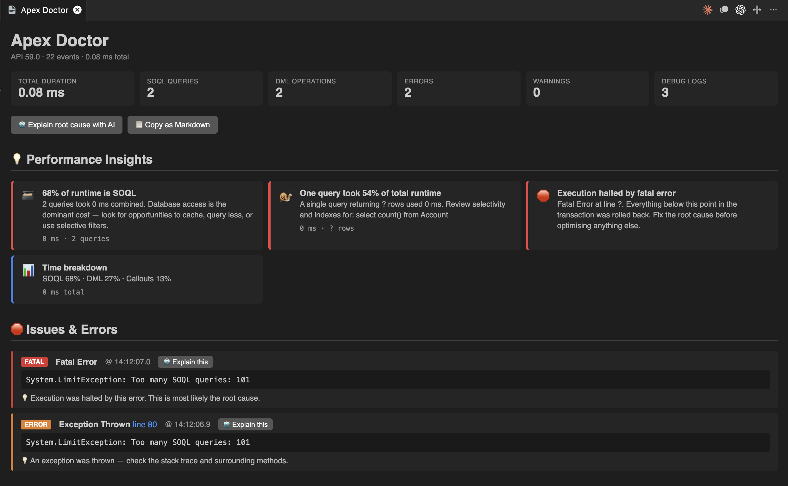
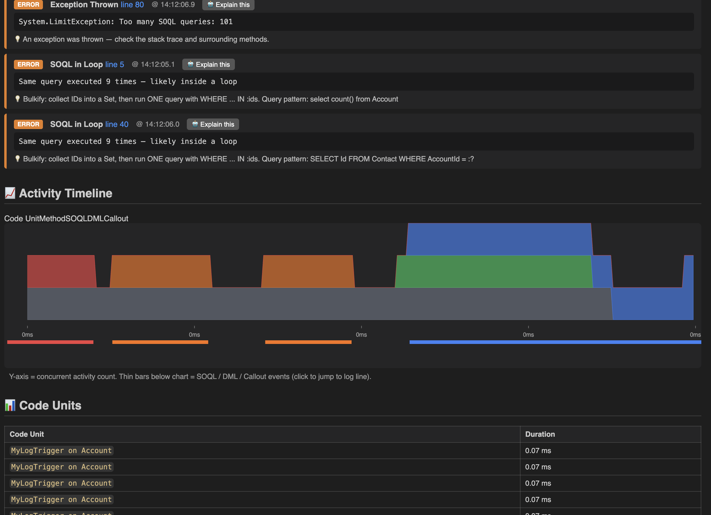
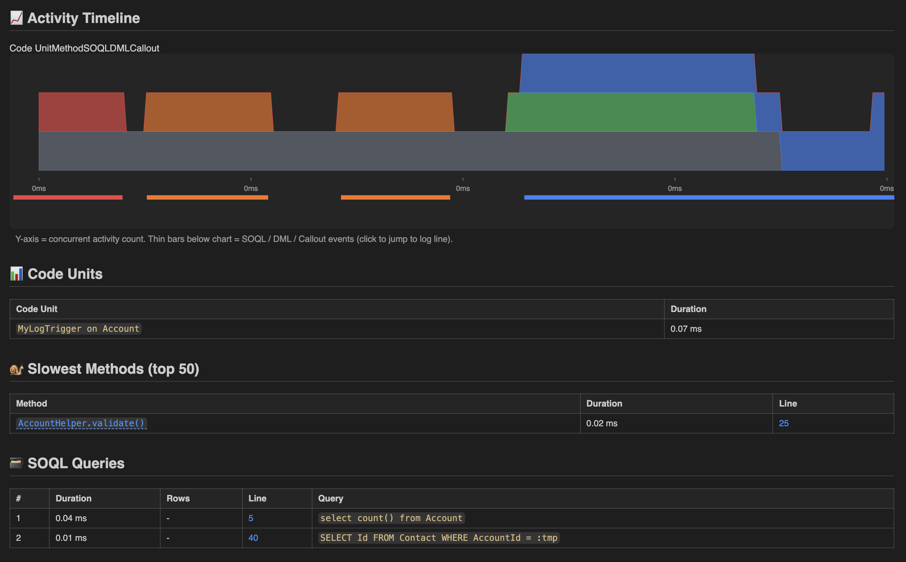

# Apex Doctor by Aman

> A VS Code extension that parses and analyses Salesforce Apex debug logs — with AI-powered root-cause explanations, performance insights, live log streaming, and one-click navigation to Apex source.



---

## ✨ What it does

Paste any Salesforce Apex debug log into VS Code, right-click, and get an instant, structured breakdown:

- 💡 **Performance Insights** — plain-English summary of where time went ("38% of your time is SOQL", "one query returned 4,562 rows")
- 🛑 **Issues & errors** — fatal errors, exceptions, SOQL-in-loop, governor-limit violations
- 📈 **Activity Timeline** — stacked area chart showing when SOQL / DML / methods / callouts ran
- 📊 **Code units** — every trigger, workflow, and execution entry point with timing
- 🐌 **Slowest methods** — top 50 methods ranked by duration
- 🗃️ **SOQL queries** — every query, row count, and execution time
- ✏️ **DML operations** — inserts, updates, deletes with row counts
- 🐞 **Debug statements** — all `System.debug()` output
- 📈 **Governor limits** — cumulative usage snapshot

---

## 💡 Performance Insights

At the top of every analysis, plain-English insights highlight exactly where time went and what's wrong:

- "🗃️ 62% of runtime is SOQL — 14 queries took 1,150 ms combined"
- "🔁 SOQL-in-loop detected — same query executed 8 times"
- "🐌 One query took 30% of total runtime — 4,562 rows"
- "🛑 Execution halted by fatal error — NullPointerException at line 230"
- "📊 Time breakdown — SOQL 62% · Methods 35% · DML 3%"

All deterministic rules — no API calls needed. Free, instant, on every analysis.

---

## 🤖 AI-assisted root-cause analysis

One click and the AI explains exactly **what went wrong, where it broke, and how to fix it** — in plain English, with working Apex code suggestions.





The response is structured into four sections:

- **Root Cause** — what actually went wrong, in plain English
- **Where it broke** — the class, method, and line number
- **Likely Fix** — concrete recommendation with an Apex code snippet
- **Prevention** — practices to prevent this class of issue recurring

**Per-issue focus**: click "Explain this" next to any detected issue to get focused analysis of just that problem.

---

## 🔗 Link directly to your Apex source

In the "Slowest Methods" table, method names like `AccountHandler.processAccounts` are clickable. Click once → opens `AccountHandler.cls` at the exact line number in the editor.

**Works with any SFDX project** — the extension reads `sfdx-project.json` and finds the class under your `packageDirectories`.

**Class not in your workspace?** No problem — you'll get a prompt offering to retrieve it from the org via `sf project retrieve`. Approve once, and the class is pulled down and opened automatically.

---

## 🔴 Live Log Streaming

Debug in real time. Click the **"⏺ Stream Apex Logs"** button in the status bar (or run "Start Log Streaming" from the Command Palette) and a dedicated panel opens showing incoming logs as they happen.

- Each new log appears in a table with operation, status, duration, size, user, and timestamp
- Click any row → full analysis of that log in the main panel
- Status bar shows a red "⏺ Streaming" indicator while active
- Polls every 3 seconds — typical latency between log completion and appearance is < 6 seconds

---

## 🚀 Getting started

```bash
git clone https://github.com/amanparate/apex-log-analyzer-by-aman.git
cd apex-log-analyzer-by-aman
npm install
npm run compile
```

Open the folder in VS Code and press **F5** to launch the Extension Development Host.

### Using it

1. Open any file containing an Apex debug log
2. Right-click in the editor → **"Analyse this Apex Log"**
3. The analysis panel opens beside your log
4. Click **"🤖 Explain root cause with AI"** for AI insights

Or fetch directly from Salesforce:

- Command Palette → **"Apex Log Analyzer: Fetch Log from Salesforce"**
- Pick a log from the last 20 → downloads, opens, and analyses in one step

Or stream live:

- Click **"⏺ Stream Apex Logs"** in the status bar
- Run any Apex in your org → see it appear in the stream panel within seconds

---

## 🔑 Setting up the AI feature

Pick one provider:

### Option A: OpenRouter (FREE — recommended for testing)

1. Sign up at [openrouter.ai](https://openrouter.ai) (no credit card required)
2. Get a free API key at [openrouter.ai/keys](https://openrouter.ai/keys)
3. Click the AI button in the extension and paste your key (starts with `sk-or-`)

Default model uses OpenRouter's free auto-router. Rate limit: ~20 requests/minute, 200/day.

### Option B: Anthropic Claude (paid, higher quality)

1. Get an API key at [console.anthropic.com](https://console.anthropic.com)
2. In VS Code settings, change `apexLogAnalyzer.provider` to `anthropic`
3. Change `apexLogAnalyzer.model` to `claude-sonnet-4-5`
4. Run **"Apex Log Analyzer: Clear LLM API Key"** then enter your new key

### 🔒 Security

API keys are stored in VS Code's encrypted `SecretStorage` — never in `settings.json`, never in source.

### 🛡️ Privacy

The extension sends a **distilled summary** to the LLM (detected issues, relevant debug statements, slowest methods, SOQL queries) — not the raw log. If your logs contain sensitive data, review the `buildContext()` method in `src/aiService.ts` and redact/filter as needed before sharing this with a team.

---

## 🔗 Salesforce Org integration

Requires the Salesforce CLI installed and authenticated:

```bash
sf org login web                         # production / developer edition
sf org login web --instance-url https://yourdomain--yoursandbox.sandbox.my.salesforce.com   # sandbox
sf config set target-org=<your-alias>
```

Features that use the CLI:

- **Fetch Log from Salesforce** — lists and downloads recent logs
- **Live Log Streaming** — polls the Tooling API for new logs
- **Retrieve Apex Class** — auto-pulls class files when you click a method name
- **User info auto-fetch** — shows who executed the log

---

## ⚙️ Commands

| Command                       | Description                                   |
| ----------------------------- | --------------------------------------------- |
| `Analyse this Apex Log`       | Analyse the current editor (or selection)     |
| `Fetch Log from Salesforce`   | Pick a log from the org → download → analyse  |
| `Start Log Streaming`         | Open the live log stream panel                |
| `Stop Log Streaming`          | Stop streaming                                |
| `Export Analysis as Markdown` | Copy full report to clipboard                 |
| `Set LLM API Key`             | Configure OpenRouter or Anthropic credentials |
| `Clear LLM API Key`           | Remove stored credentials                     |

---

## ⚙️ Settings

| Setting                               | Default           | Description                                                 |
| ------------------------------------- | ----------------- | ----------------------------------------------------------- |
| `apexLogAnalyzer.provider`            | `openrouter`      | `openrouter` (free) or `anthropic` (paid)                   |
| `apexLogAnalyzer.model`               | `openrouter/free` | Model ID. Use `claude-sonnet-4-5` for Anthropic             |
| `apexLogAnalyzer.maxTokens`           | `1500`            | Max tokens for AI response                                  |
| `apexLogAnalyzer.soqlInLoopThreshold` | `5`               | Flag SOQL-in-loop when same query repeats this many times   |
| `apexLogAnalyzer.largeQueryThreshold` | `1000`            | Flag a query as "large" when it returns ≥ this many rows    |
| `apexLogAnalyzer.streamDebugLevel`    | `""`              | Optional debug level for `sf apex tail log --debug-level X` |

---

## 📤 Export

Click **"📋 Copy as Markdown"** on any analysis to copy a full report to your clipboard:

- Summary metrics
- Issues with severity and line numbers
- AI root-cause analysis (if generated)
- Top 20 slowest methods table
- All SOQL queries table
- All DML operations table

Ready to paste into Jira, Slack, or pull request descriptions.

---

## 📦 Packaging as a .vsix

```bash
npm install -g @vscode/vsce
vsce package
```

Produces a `.vsix` file you can install via VS Code → Extensions → **Install from VSIX**.

---

## 🛠️ Tech stack

- **TypeScript** (strict mode)
- **esbuild** for fast bundling
- **Node.js `https`** — zero runtime dependencies for API calls
- **VS Code Webview API** for themed panel rendering
- **VS Code SecretStorage** for encrypted credentials
- **Salesforce CLI (`sf`)** for org integration
- **Tooling API** (via `sf data query`) for log listing and streaming

---

## 🗺️ Roadmap

Planned for future versions:

- **Compare two logs** — side-by-side diff of summary deltas, issues, slowest methods
- **Follow-up chat** — ask the AI questions about the log ("what if I made this query selective?")
- **SOQL Query Plan integration** — selectivity check via the Salesforce Query Plan Tool
- **Generate Apex test class** — AI-generated repro test for failing logs
- **Publish to VS Code Marketplace** — one-click install for any developer

---

## 📝 License

MIT — see [LICENSE](LICENSE) for details.

---

## 💙 Author

Built by [Aman Parate](https://github.com/amanparate).

Feedback, issues, and pull requests welcome!
